# Hi, I am Peter 👋

I am a Chapter Lead with a strong passion for building enterprise grade systems and software.

I have had many different roles and some would say that how I work is mostly in the category where the job-title could be 42 or *

> The Answer to the Great Question... Of Life, the Universe and Everything... Is... Forty-two,' said Deep Thought, with infinite majesty and calm.  
_-Douglas Adams, The Hitchhiker's Guide to the Galaxy_

Some career and education debt:

- :orange_book: B.Sc. in Civil Engineering, Energy & Indoor Climate @ [Aarhus University][aarhus-university] :office:
- :green_book: M.Sc. in Civil Engineering, Integrated Energy Design @ [Aarhus University][aarhus-university] :zap:
- :blue_book: Academy profession in Software development @ [Smartlearning] part of [Cph Business][cphbusiness] :computer:
- :mag: Prev. Quality Manager
- :computer: Prev. Full stack developer
- :cloud: Prev. Cloud Architect
- 📑 Prev. Platform Owner

 

[aarhus-university]: https://www.au.dk
[smartlearning]: https://www.smartlearning.dk/
[cphbusiness]: https://www.cphbusiness.dk/english
